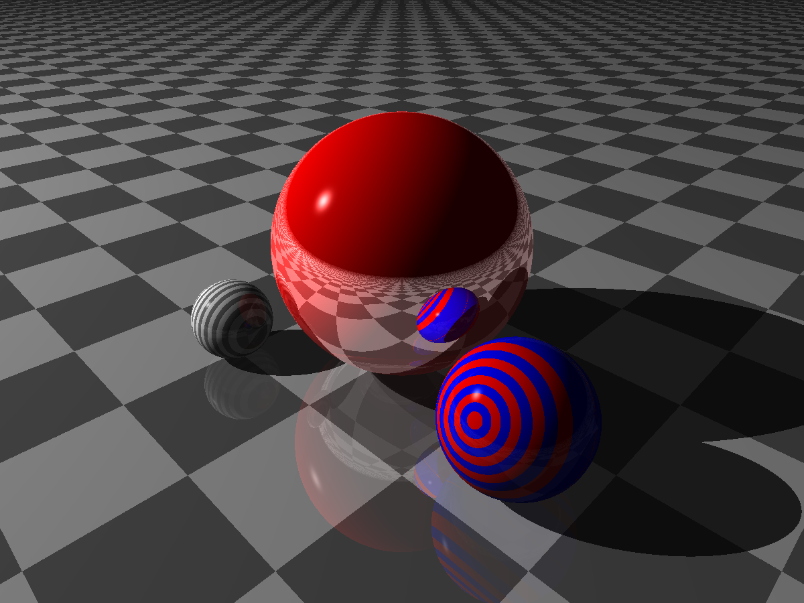

# Kotlin Raytracer

A basic raytracer in Kotlin. Kotlin may not be the best choice of language to write a raytracer but it was fun to try and this should be considered a learning exercise.



## Getting Started

Build the project:

```
./gradlew build
```

Run to produce a render of a basic scene:

```
./gradlew run
```

The output is an image in PPM format, a simple but inefficient image format. It can be viewed with
many image viewers including Mac Preview.

The output file is located at: `app/renders/image.ppm`

## License

This project is licensed under the MIT License - see the LICENSE.md file for details

## Acknowledgments

* [The Ray Tracer Challenge](https://pragprog.com/titles/jbtracer/the-ray-tracer-challenge/)